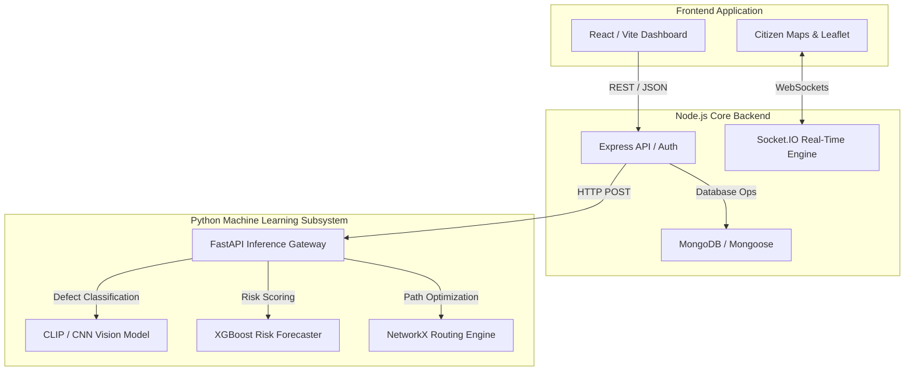

# 🛡️ PRAHARI-AI — AI Sentinel for Safer Roads 🚔
> A Unified, Autonomous AI-Powered Ecosystem Connecting Citizens, Municipal Authorities, and Emergency Services


---

## 📑 Table of Contents
1. 🚀 [Executive Summary](#1-executive-summary)
2. 🏆 [Hackathon Details](#2-hackathon-details)
3. ⚠️ [The Core Problem](#3-the-core-problem)
4. 💡 [Our Innovative Solution (USP)](#4-our-innovative-solution-usp)
5. 🧩 [Key Product Modules](#5-key-product-modules)
6. 🏗️ [System Architecture & Data Flow](#6-system-architecture--data-flow)
7. 💻 [Comprehensive Tech Stack](#7-comprehensive-tech-stack)
8. 🧠 [Machine Learning & AI Engine Deep-Dive](#8-machine-learning--ai-engine-deep-dive)
9. 📂 [Project Directory Structure](#9-project-directory-structure)
10. 🔄 [End-to-End System Workflow](#10-end-to-end-system-workflow)
11. 🔌 [Detailed API Reference](#11-detailed-api-reference)
12. ⚙️ [Installation & Local Setup Guide](#12-installation--local-setup-guide)
13. 🔐 [Environment Variables Configuration](#13-environment-variables-configuration)
14. 🕹️ [Usage Instructions & Demo Flow](#14-usage-instructions--demo-flow)
15. 🚧 [Challenges Faced & Workarounds](#15-challenges-faced--workarounds)
16. 🔭 [Future Scope & Vision](#16-future-scope--vision)

---

## 🚀 1. Executive Summary

**Prahari-AI** is a smart, autonomous, tri-layered intelligence platform designed to eliminate the gaps in urban road safety and maintenance. By crowdsourcing road hazard data from citizens, instantly triaging it through advanced Computer Vision, forecasting the long-term deterioration risk using Machine Learning, and dynamically reweighting emergency routing graphs, Prahari-AI ensures that authorities fix the right problems at the right time, and ambulances always take the safest and fastest route.

## 🏆 2. Hackathon Details

- **Event**: Internal Smart India Hackathon (SIH) 2026
- **Team Name**: COMMAND + WIN
- **Institution**: MNNIT Allahabad
- **Theme**: Transportation and Logistics

---

## ⚠️ 3. The Core Problem

India has the highest road accident fatality rate in the world. Two major factors contribute to this:

1. **Reactive, Fragmented Maintenance**: Road infrastructure defects (potholes, garbage overflow, broken streetlights, waterlogging) are reported manually by citizens. These reports are often misrouted among various municipal departments, causing massive delays in triage and repair. This leads to long-term degradation of critical roadways.
2. **Blind Emergency Routing**: When an accident occurs, ambulances rely on standard navigation tools (like Google Maps) that optimize purely for distance or standard traffic. They do not actively account for *safety*, live road hazards, or predictive accident risk zones, leading to delays caused by blockages or degraded roads.

Presently, infrastructure condition and accident risks are treated in isolated silos. **They shouldn't be.**

---

## 💡 4. Our Innovative Solution (USP)

Prahari-AI breaks down the silos by connecting civic reporting directly to emergency response. 

**The Unique Selling Propositions:**
- **Tri-layered Intelligence Ecosystem**: Combines Computer Vision (for live defect intake), Predictive ML (for a 30-day degradation forecast), and Graph Optimization (for routing).
- **"Safest" over "Shortest" Routing**: Emergency routing actively avoids newly detected hazard zones in real-time, modifying OSRM/NetworkX edge weights dynamically.
- **Automated Triage & closed-Loop System**: Citizens report a defect -> AI classifies it -> AI determines the department -> AI predicts 30-day risk -> Authorities repair it -> AI verifies the repair via after-photos. Zero manual bottlenecks.

---

## 🧩 5. Key Product Modules

### 👤 Citizen Module
- **Live Defect Reporting**: Capture photos of road issues.
- **AI-Powered Chatbot Integration**: Speak or chat to report issues or check road statuses.
- **Live Safety Alerts & Risk Maps**: See real-time hazard zones in your vicinity.
- **Accident Reporting**: Direct emergency SOS routing to nearby hospitals.

### 🏛️ Municipal Authority Dashboard
- **Central Operations Command**: Unified view of all complaints across the city.
- **Automated Department Routing**: Potholes go to Public Works, Streetlights to Electrical, etc.
- **AI-Driven Repair Prioritization**: Work orders are ranked not just by age, but by the ML-forecasted "Risk Delta" (how dangerous the road will become if left unfixed).
- **Field Team Management**: Assign tasks to on-ground repair squads.
- **Visual AI Verification**: Field workers upload a repair photo; the AI confirms the fix before closing the ticket.

### 🚑 Emergency & Routing Engine
- **Dynamic Heatmaps**: Visualizes predictive risk scores across the city map.
- **Real-Time Obstacle Avoidance**: The routing engine ingests the live infrastructure defects to compute the mathematically optimal safest route.

---

## 🏗️ 6. System Architecture & Data Flow

Prahari-AI utilizes a microservices-inspired architecture, decoupling the heavy machine learning workloads from the real-time Node.js I/O API.



### Data Flow Example (Defect Reporting)
1. **Intake**: A citizen uploads an image via React.
2. **API**: Node.js receives the multipart form data, stores the image in Cloudinary (or local uploads), and sends the URL to the Python ML Service.
3. **Inference**: Python uses PyTorch to classify the image as a "High Severity Pothole".
4. **Scoring**: The Predictive engine recalculates the risk score for that specific coordinate.
5. **Update**: Node.js saves the processed complaint to MongoDB and fires a Socket.IO event.
6. **Live Update**: The Authority Dashboard map updates in real-time, displaying a new red hazard zone.

---

## 💻 7. Comprehensive Tech Stack

### Frontend (Client Layer)
- **Framework**: React.js 19 with Vite (TypeScript/JavaScript).
- **Styling**: Tailwind CSS v4, custom glassmorphism components.
- **Maps**: Leaflet.js (`react-leaflet`) for geospatial plotting, D3-Geo.
- **Animations**: Framer Motion.
- **State/Routing**: React Router DOM, Axios for data fetching.

### Backend (Server Layer)
- **Core Environment**: Node.js v18+.
- **Framework**: Express.js 5.x.
- **Database**: MongoDB (Mongoose ORM) with Geospatial indexing capabilities.
- **Real-Time**: Socket.IO for live dashboard updates.
- **Authentication**: JWT (JSON Web Tokens), Bcryptjs for password hashing.
- **File Handling**: Multer for image parsing.

### Machine Learning & Routing (Python Subsystem)
- **API Framework**: FastAPI & Uvicorn.
- **Computer Vision**: PyTorch, Torchvision, HuggingFace Transformers (CLIP).
- **Predictive Modeling**: Scikit-Learn, XGBoost, Pandas, Numpy.
- **Graph Routing Engine**: NetworkX, OSMnx, SciPy.

---

## 🧠 8. Machine Learning & AI Engine Deep-Dive

The true brains of Prahari-AI live in the `ml-model/src` directory. Here is what each script does:

1. **`clip_classifier.py`**: A computer vision module utilizing transfer learning. When a citizen uploads an image, it identifies the type of defect (pothole, garbage, breakage) and assigns a confidence interval.
2. **`predictive_maintenance.py`**: A time-series forecaster that analyzes defect velocity, time since last repair, traffic stress, and weather patterns to output a **30-Day Risk Forecast**. It warns authorities *before* a road fails.
3. **`repair_priority.py`**: An optimization algorithm that takes the outputs from the predictive maintenance model and ranks municipal work orders. A severe pothole on a high-speed arterial road will be ranked higher than a minor defect on a residential street.
4. **`routing_integration.py`**: A map graph penalization engine. It takes standard OpenStreetMap graphs and mathematically increases the "weight" (cost) of edges that contain active, un-repaired defects. This forces emergency algorithms (like Dijkstra or A*) to find safer alternative routes.
5. **`duplicate_detector.py`**: Groups similar complaints based on geospatial proximity to prevent authorities from being spammed by 50 reports of the same pothole.
6. **`copilot_engine.py` / `citizen_chatbot.py`**: LLM integrations allowing conversational querying of the road data (e.g., "What is the status of the road block on MG Marg?").

---

## 📂 9. Project Directory Structure

```text
prahari-ai/
├── backend/                  # Node.js + Express API
│   ├── .env                  # Secrets for Node API
│   ├── src/
│   │   ├── controllers/      # Business logic (complaints, auth, routing)
│   │   ├── db/               # MongoDB connection logic
│   │   ├── middlewares/      # JWT protection, multer config
│   │   ├── models/           # Mongoose Schemas (User, Complaint, WorkOrder)
│   │   ├── routes/           # Express Routers
│   │   ├── socket/           # Real-time WebSocket handlers
│   │   └── index.js          # Server entry point
│   └── package.json
│
├── frontend/                 # React + Vite Client
│   ├── .env.example          # VITE_ API keys
│   ├── src/
│   │   ├── components/       # Reusable UI (Buttons, Modals, Map overlays)
│   │   ├── layouts/          # Authority vs Citizen wrapper layouts
│   │   ├── pages/            # Login, Dashboards, Report Pages
│   │   ├── services/         # Axios API call wrappers
│   │   └── App.jsx           # React Router DOM definitions
│   └── package.json
│
├── ml-model/                 # Python Inference Services
│   ├── src/                  # AI scripts (Vision, XGBoost, Routing)
│   ├── server.py             # FastAPI entry point
│   ├── predict.py            # CLI wrapper for inference
│   ├── trained_models/       # .pkl and .pt weights
│   └── requirements.txt      # Python dependencies
│
├── docs/                     # Architecture diagrams and presentation assets
└── points.txt                # Sample geospatial polygon data
```

---

## 🔄 10. End-to-End System Workflow

To visualize how the pieces connect, follow a standard "Pothole to Repair" lifecycle:

1. **Citizen App (React)**: User clicks "Report", takes a photo, GPS is appended.
2. **API (Express)**: `POST /api/complaints` receives the request.
3. **ML Microservice (FastAPI)**: Express forwards the image to Python. `clip_classifier.py` says "Pothole - High Severity".
4. **Database (MongoDB)**: Express saves a `Complaint` document. It sets `department: "Public Works"`.
5. **AI Ranking (Python)**: `repair_priority.py` evaluates the new complaint against existing ones and bumps it to #1 priority.
6. **Authority App (React)**: The Socket.IO server pushes an event. The Public Works dashboard flashes red with a new critical task.
7. **Emergency Routing (Python)**: Simultaneously, `routing_integration.py` increases the weight of that street. If an ambulance is dispatched, it is now routed around the pothole.
8. **Resolution**: The field worker patches the hole, uploads a photo to `POST /api/complaints/:id/verify`. AI confirms the repair, closes the ticket, and the routing graph returns to normal.

---

## 🔌 11. Detailed API Reference

Below is a subset of the extensive REST APIs provided by the Node.js backend.

### Authentication (`/api/auth`)
| Method | Endpoint | Description | Auth? |
|--------|----------|-------------|-------|
| `POST` | `/register` | Create citizen/authority account | ❌ |
| `POST` | `/login` | Authenticate and return JWT token | ❌ |
| `GET`  | `/me` | Fetch active user profile data | ✅ |

### Complaints & Defect Management (`/api/complaints`)
| Method | Endpoint | Description | Auth? |
|--------|----------|-------------|-------|
| `POST` | `/` | Create a new defect report (multipart/form-data) | ✅ |
| `GET`  | `/me` | Get all reports submitted by the logged-in citizen | ✅ |
| `GET`  | `/` | Authorities: fetch all city-wide complaints | ✅ |
| `PATCH`| `/:id/status`| Authorities: update workflow status (Pending -> WIP) | ✅ |
| `PATCH`| `/:id/assign`| Command center assigns a field team to a ticket | ✅ |
| `POST` | `/:id/verify`| Field teams upload proof-of-repair photos | ✅ |

### Core Safety Features
| Method | Endpoint | Description | Auth? |
|--------|----------|-------------|-------|
| `GET`  | `/api/emergency/route` | Returns GeoJSON for the safest path between A and B | ✅ |
| `GET`  | `/api/risk/predict` | Triggers the 30-day risk forecast ML service | ✅ |
| `GET`  | `/api/roads` | Fetches aggregate road health statistics | ✅ |

---

## ⚙️ 12. Installation & Local Setup Guide

Follow these steps precisely to spin up the entire ecosystem on your local machine.

### Prerequisites
- **Node.js**: v18.0 or higher.
- **Python**: v3.10 or higher.
- **MongoDB**: Locally installed (MongoDB Compass) or a free MongoDB Atlas cluster.
- **Git**: For cloning the repository.

### Step 1: Clone the Repo
```bash
git clone https://github.com/praveen-codes36/prahari-ai
cd prahari-ai
```

### Step 2: Boot up the Node.js Backend
```bash
cd backend
npm install

# Copy the environment file and edit it with your DB credentials
cp .env.example .env

# Run the development server (uses nodemon)
npm run dev
# Expected output: App listening on port http://localhost:5000
```

### Step 3: Boot up the React Frontend
Open a new terminal window.
```bash
cd frontend
npm install

# Setup your VITE env variables
cp .env.example .env

# Start the Vite bundler
npm run dev
# Expected output: Network: http://0.0.0.0:3000
```

### Step 4: Boot up the Python ML Microservice
Open a third terminal window.
```bash
cd ml-model

# Create a virtual environment to isolate dependencies
python -m venv venv

# Activate it (Windows)
venv\Scripts\activate
# Activate it (Mac/Linux)
# source venv/bin/activate

# Install heavy ML packages (may take a few minutes)
pip install -r requirements.txt

# Start the FastAPI server on port 8000
uvicorn server:app --reload
```

---

## 🔐 13. Environment Variables Configuration

Do not commit your real `.env` files. Use the provided `.env.example` templates.

### Backend (`backend/.env`)
```ini
# MongoDB Connection String
MONGO_URI=mongodb+srv://<user>:<password>@cluster.mongodb.net/prahari_db
# API Port
PORT=5000
# JWT Signing Key
JWT_SECRET=super_secret_random_string
# Email SMTP details for alerts
EMAIL_USER=your_email@gmail.com
EMAIL_PASS=your_app_password
# Connections to Python Service
ML_SERVICE_URL=http://127.0.0.1:8000
# AI Chatbot LLM Key
GEMINI_API_KEY=your_gemini_key
```

### Frontend (`frontend/.env`)
```ini
# Points React to the Node Backend
VITE_API_BASE_URL=http://localhost:5000
# Mapbox/Leaflet tokens (if applicable)
VITE_MAPBOX_TOKEN=your_token
```

---

## 🕹️ 14. Usage Instructions & Demo Flow

To demonstrate the full power of Prahari-AI to hackathon judges, follow this script:

1. **The Citizen View**: Open the frontend at `http://localhost:3000`. Log in as a citizen.
2. **Report a Problem**: Navigate to the "Report Defect" page. Upload a sample picture of a pothole from the `backend/public/sample_images` folder. Submit it.
3. **The ML Magic**: Watch the terminal of the Python service. You will see it process the image, classify it as a pothole, and trigger the `predictive_maintenance.py` script.
4. **The Authority View**: Open an incognito window and log in as an Authority. Go to the dashboard. You will see the new complaint automatically routed to the "Public Works" department without human intervention.
5. **The Map**: Go to the "Live Risk Map". You will see a new red heat-zone over the coordinate where you submitted the pothole.
6. **The Routing**: Trigger an emergency route request that passes through that coordinate. The map will draw a route that actively detours *around* the red heat-zone, proving the dynamic reweighting works.

---

## 🚧 15. Challenges Faced & Workarounds

Building a multi-layered distributed AI system in a short timeframe presented several technical hurdles:

- **Challenge: Real-Time Map State Synchronization**. Updating hundreds of geospatial points on React Leaflet maps without freezing the UI when Python updated risk scores.
  - **Solution**: We implemented Socket.IO rooms. Instead of polling the backend, the Node server only emits targeted websocket events to the frontend when a specific road segment's risk score changes, drastically reducing React re-renders.
- **Challenge: Heavy Computer Vision Latency**. Running a deep CNN model on every image upload synchronously caused the API to time out.
  - **Solution**: We decoupled the architecture. The Node.js API saves the image and responds "Processing" to the user immediately, then fires a background HTTP request to the Python FastAPI service, which updates the database asynchronously when finished.
- **Challenge: Dynamic Graph Modification**. Traditional routing engines (like standard OSRM) pre-compile static graphs and don't allow real-time edge weight manipulation easily.
  - **Solution**: We utilized Python's `NetworkX` to maintain an active in-memory directed graph of the city's key arterials. When a defect is reported, we dynamically scale the weight of that specific edge matrix before calculating the shortest path.

---

## 🔭 16. Future Scope & Vision

Prahari-AI is designed to be the foundational operating system for Smart City roadways. Future additions include:

1. **IoT Fleet Edge Computing**: Mounting Raspberry Pi + Camera units on municipal garbage trucks and buses to passively scan the roads as they drive, completely removing the reliance on manual citizen reports.
2. **Blockchain Immutability**: Logging all municipal work orders, fund allocations, and AI-verified repair photos on a public ledger to guarantee absolute civic transparency and eliminate corruption in infrastructure spending.
3. **Weather API Deep Integration**: Hooking directly into localized meteorological data to predict monsoon waterlogging days before it happens, preemptively routing traffic away from low-elevation zones.

---


**Team: COMMAND + WIN**

---
*Built with ❤️ for Smart India Hackathon 2026. Empowering citizens, enabling authorities, and saving lives.*
