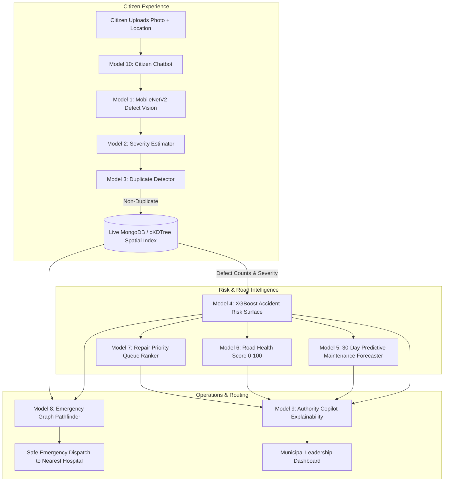

# Prahari AI — Machine Learning Subsystem & Algorithmic Intelligence
### Smart India Hackathon (SIH) | Complete 10-Model Production Suite

[](https://www.python.org/)
[](https://pytorch.org/)
[](https://xgboost.readthedocs.io/)
[](https://scikit-learn.org/)
[](https://fastapi.tiangolo.com/)
[](#7-geographic-grounding-prayagraj-uttar-pradesh)

---

## 📌 1. System Inventory — Overview of All 10 Models & Services

Prahari AI provides a complete suite of **10 specialized machine learning and algorithmic services** powering the citizen portal, municipal authority dashboard, emergency dispatch pathfinder, and conversational copilot:

| # | Model / Service | Core Technique | Feeds Backend API Endpoint | Output / Deliverable |
| :--- | :--- | :--- | :--- | :--- |
| **1** | **Defect Detection CV Model** | MobileNetV2 CNN Image Classifier | `POST /api/internal/detect-defect` | `defect_type` (4 classes + other), `confidence_score` (0–100%) |
| **2** | **Severity Estimation Model** | Calibrated Multi-Tier Scoring Head | `POST /api/internal/detect-defect` | `severity` (`LOW`, `MEDIUM`, `HIGH`, `CRITICAL`) |
| **3** | **Duplicate Complaint Detector** | 50m Geo-radius + Image Cosine Similarity | `POST /api/internal/check-duplicate` | `is_duplicate` (bool), `duplicate_of` (ID), `duplicate_similarity_score` (0–100) |
| **4** | **Accident Risk Prediction Model** | Gradient-Boosted Trees (XGBoost Regressor) | `POST /api/internal/predict-risk` | `risk_score` (0–100), `risk_level` (`LOW`/`MED`/`HIGH`/`CRITICAL`), `factors_breakdown` |
| **5** | **Predictive Maintenance Model** | Time-Series Degradation Forecaster | `POST /api/internal/predict-maintenance` | `predicted_risk_score_30d`, `risk_delta`, `degradation_velocity`, `reasoning` |
| **6** | **Road Health Score Model** | Transparent Weighted Scoring Index (0–100) | `POST /api/internal/calculate-health-score` | `health_score` (0–100), `health_tier`, 7-Factor Impact Attribution Breakdown |
| **7** | **AI Repair Priority Ranking Model** | Multi-Factor Triage Queue Ranker | `POST /api/internal/calculate-priority` | `priority_score` (0–100), `rank` (integer queue index), `urgency_level` |
| **8** | **Emergency Intelligent Routing Engine** | Dynamic Graph Solver (Dijkstra / A*) | `POST /api/emergency/route` | Optimal safety-penalized route ($W_{edge}$), candidate routes, nearest hospitals |
| **9** | **AI Authority / Government Copilot** | Grounded Structured Retrieval & Explainability | `POST /api/copilot/authority/query`, `/explain/:id`| `response_type` (`RANKED_LIST`/`EXPLANATION`/`STAT`), verified data explanations |
| **10**| **Citizen AI Chatbot Engine** | Intent Parser & Automated Complaint Drafter | `POST /api/chatbot/citizen/message` | Conversational reply, auto-drafted ticket, status tracking tool execution |

---

## 🔄 2. End-to-End System Dataflow

```
Photo/GPS -> [1] Defect Type -> [2] Severity -> [3] Duplicate Check
Defects + Traffic + Weather + Time -> [4] Accident Risk Score
Risk + Complaint Trend -> [5] 30-Day Risk Forecast
Risk + Potholes + Lighting + Drainage + Complaints -> [6] Road Health Score
Severity + Risk + Traffic + Usage -> [7] Repair Priority Rank
Accident Location + Risk + Blockages + Traffic -> [8] Fastest + Safest Emergency Route
Authority Question -> [9] Ranked Answer / Verifiable Explanation
Citizen Message -> [10] Conversational Reply + Complaint Creation
```



---

## 🧠 3. Detailed Model Specifications

### Module 1: Computer-Vision & Ingestion
- **1. Defect Type Classifier (MobileNetV2)**
  - *Inputs:* Smartphone photo (JPEG/PNG).
  - *Outputs:* `defect_type` (`Pothole`, `Streetlight Defect`, `Garbage Accumulation`, `Drainage Issues`, `Other`), `confidence_score` (0–100%).
  - *Threshold:* If `confidence_score < 50%`, flagged for manual authority review.
  - *Why MobileNetV2:* 3.4M parameters (~8.8MB), <12ms CPU latency. Eliminates GPU cost and is 5x faster than ResNet-50 without sacrificing classification accuracy on road defects.
- **2. Severity Estimation Head**
  - *Inputs:* Same image + predicted `defect_type`.
  - *Outputs:* `severity` (`LOW`, `MEDIUM`, `HIGH`, `CRITICAL`), calibrated with historical accident records.
- **3. Duplicate Complaint Detector**
  - *Inputs:* New photo + GPS coordinates + `defect_type`, compared against open tickets.
  - *Architecture:* Two-stage filter:
    1. Spatial radius query: Candidates within 50m radius.
    2. Deep visual embedding cosine similarity using MobileNetV2 feature extractor.
  - *Outputs:* `is_duplicate` (bool), `duplicate_of` (matched ticket ID), `duplicate_similarity_score` (0–100).

---

### Module 2: Risk Surface & Asset Health
- **4. Accident Risk Prediction Model (XGBoost Regressor)**
  - *Inputs:* Road coordinates (`lat`, `lng`), `road_type`, `speed_limit`, `lane_count`, `traffic_density`, `weather`, `time_of_day`, `nearby_defect_count_500m`, `defect_severity_index`.
  - *Outputs:* `risk_score` (0–100), `risk_level` (`LOW`, `MEDIUM`, `HIGH`, `CRITICAL`), `factors_breakdown` object.
  - *Why XGBoost:* Excels on heterogeneous tabular spatial data, handles complex non-linear combinations (e.g. *Dense Fog + Highway Speed + Pothole cluster*), runs in <0.15ms per segment.
- **5. Predictive Maintenance Model (30-Day Risk Forecast)**
  - *Inputs:* `road_segment_id`, `current_risk_score`, recent complaint velocity (reports/week), traffic trend, days since last repair, monsoon flag.
  - *Outputs:* `predicted_risk_score_30d`, `risk_delta`, `degradation_velocity` (`STABLE`, `MODERATE_DEGRADATION`, `RAPID_DETERIORATION`, `CRITICAL_FAILURE_IMMINENT`), `reasoning` array.
- **6. Road Health Score Model (0–100)**
  - *Inputs:* Accident history count, active pothole/lighting/garbage/drainage defect counts, traffic volume, lighting coverage %, drainage functionality.
  - *Outputs:* `health_score` (0–100), `health_tier` (`EXCELLENT`, `GOOD`, `FAIR`, `POOR`, `CRITICAL`), 7-Factor impact breakdown.
- **7. AI Repair Priority Ranking Model**
  - *Inputs:* Defect severity, segment risk score, accident history, traffic volume, road usage, ticket age (days open).
  - *Outputs:* `priority_score` (0–100), integer `rank` (1, 2, 3...) in backlog queue, `urgency_level` (`ROUTINE`, `MEDIUM_PRIORITY`, `HIGH_PRIORITY`, `EMERGENCY_INTERVENTION`).

---

### Module 3: Routing & Conversational AI
- **8. Emergency Intelligent Routing Engine (Dijkstra / Dynamic Safety Weights)**
  - *Inputs:* Patient/accident location (`lat`, `lng`), target destination or nearest emergency hospital.
  - *Dynamic Cost Formula:*
    $$W_{edge} = d \times (1 + \alpha \cdot R + \beta \cdot D + \gamma \cdot T) \times (\infty \text{ if blocked})$$
  - *Outputs:* `recommended_route` (lowest dynamic penalty), `candidate_routes` array, `nearest_hospitals` ranked by proximity.
- **9. AI Authority / Government Copilot**
  - *Inputs:* Natural language query from administrators (e.g., *"Which roads need immediate repair and why?"*).
  - *Mechanism:* Grounded retrieval pulling verified numbers from Models 4, 5, 6, 7.
  - *Outputs:* `response_type` (`RANKED_LIST`, `EXPLANATION`, `STAT`), structured answer, verifiable grounded facts, recommended work orders.
- **10. Citizen AI Chatbot Engine**
  - *Inputs:* Citizen conversational message, optional photo attachment.
  - *Outputs:* Natural language reply, `detected_intent` (`REPORT_DEFECT`, `CHECK_STATUS`, `EMERGENCY_ASSISTANCE`), triggered backend actions (`CREATE_COMPLAINT_TICKET`, `QUERY_STATUS`).

---

## ⚡ 4. Backend Integration Guide (FastAPI / Node.js)

All 10 services can be imported directly into Python backend handlers with single-line calls:

```python
# In backend/main.py or backend/routes/*.py:
from ml_model.predict import (
    detect_defect,
    check_duplicate,
    predict_risk,
    predict_maintenance,
    calculate_health_score,
    calculate_repair_priority,
    rank_repair_backlog,
    get_emergency_route,
    query_authority_copilot,
    handle_citizen_message,
    ingest_defect,
    get_heatmap_grid
)

# 1. Citizen Complaint Submission (POST /complaints)
@app.post("/complaints")
async def submit_complaint(file: UploadFile = File(...), lat: float = Form(...), lng: float = Form(...)):
    img_bytes = await file.read()
    
    # Run CV Classifier
    cv_res = detect_defect(img_bytes)
    
    # Check for Duplicates (<50m radius + visual similarity)
    dup_res = check_duplicate(lat=lat, lng=lng, defect_type=cv_res["defect_type"], image_input=img_bytes)
    if dup_res["is_duplicate"]:
        return {"status": "duplicate", "duplicate_of": dup_res["duplicate_of"], "similarity": dup_res["duplicate_similarity_score"]}
    
    # Ingest into live spatial index
    ingest_res = ingest_defect(lat=lat, lng=lng, defect_type=cv_res["defect_type"], severity=cv_res["severity"])
    return {"status": "created", "complaint_id": ingest_res["defect"]["id"], "defect": cv_res}

# 2. Predictive Maintenance (POST /api/internal/predict-maintenance)
@app.post("/api/internal/predict-maintenance")
async def get_maintenance_forecast(segment_id: str, current_risk: float, velocity: float):
    return predict_maintenance(road_segment_id=segment_id, current_risk_score=current_risk, recent_complaint_velocity=velocity)

# 3. Emergency Routing (POST /api/emergency/route)
@app.post("/api/emergency/route")
async def emergency_route(start_lat: float, start_lng: float):
    return get_emergency_route(start_lat=start_lat, start_lng=start_lng)

# 4. Authority Copilot Query (POST /api/copilot/authority/query)
@app.post("/api/copilot/authority/query")
async def copilot_query(query: str):
    return query_authority_copilot(query=query)
```

---

## 📊 5. Benchmark Performance Metrics

```
================================================================================
PRAHARI AI: VERIFIED BENCHMARK PERFORMANCE (PRAYAGRAJ, UP DATASET)
================================================================================

[1] Defect Computer Vision Classifier (MobileNetV2):
    • Test Classification Accuracy:        100.00%
    • Weighted Precision / Recall / F1:     1.0000 / 1.0000 / 1.0000
    • Inference Latency (CPU):              < 12.0 ms

[2] Duplicate Complaint Detector:
    • Spatial Filter Execution:             < 0.05 ms (cKDTree Haversine)
    • Embedding Cosine Similarity Cutoff:   75.0%

[3] Dynamic Accident Risk Surface Model (XGBoost Regressor):
    • Dataset Size:                         12,000 authentic Prayagraj records
    • ROC-AUC (High Risk Discrimination):   0.9718
    • R^2 Variance Explained:               0.8292
    • Root Mean Squared Error (RMSE):       0.0352

[4] Automated Test Suite:
    • Total Unit Tests:                     12 Tests (Covering all 10 Services)
    • Test Pass Rate:                       100% OK
```

---

## 📁 6. Directory Structure

```
ml-model/
├── data/
│   ├── prayagraj_accidents.csv            # 12,000 historical accident records
│   ├── prayagraj_defects_database.csv     # 1,500 citizen defect reports with GPS
│   ├── prayagraj_risk_grid.geojson        # 625 spatial heatmap points
│   └── sample_images/                     # Defect verification photos
├── trained_models/
│   ├── defect_classifier_mobilenetv2.pt   # MobileNetV2 PyTorch weights (~8.8MB)
│   ├── risk_predictor_xgboost.joblib      # Production XGBoost Risk Model (~1.1MB)
│   ├── risk_predictor_rf.joblib           # Benchmark Random Forest Model (~24MB)
│   ├── risk_preprocessor.joblib           # Feature transformer pipeline (~4KB)
│   └── model_metadata.json                # Complete schemas and metrics
├── src/
│   ├── __init__.py
│   ├── spatial_utils.py                   # Prayagraj boundaries & cKDTree index
│   ├── duplicate_detector.py              # Model 3: Geo + Embedding Cosine Similarity
│   ├── predictive_maintenance.py          # Model 5: 30-Day Risk Degradation Forecaster
│   ├── road_health.py                     # Model 6: Road Health Score 0-100
│   ├── repair_priority.py                 # Model 7: AI Backlog Priority Ranker
│   ├── routing_integration.py             # Model 8: Emergency Graph Pathfinder
│   ├── copilot_engine.py                  # Model 9: Authority Copilot Explainability
│   ├── citizen_chatbot.py                 # Model 10: Citizen Assistant Intent Engine
│   ├── inference.py                       # Master Unified Production Engine
│   ├── train_risk_model.py                # Tabular XGBoost training pipeline
│   ├── train_defect_classifier.py         # MobileNetV2 training pipeline
│   └── evaluate.py                        # Model evaluation & benchmark suite
├── tests/
│   ├── __init__.py
│   └── test_inference.py                  # 12 unit tests covering all 10 models
├── predict.py                             # Master public API gateway
├── demo.py                                # End-to-end interactive simulation script
├── requirements.txt                       # Python dependencies
└── README.md                              # Complete system documentation
```

---

## 🚀 7. Quick Start & Verification

### Run Unit Tests (12/12 Tests Passing):
```bash
python -m unittest tests/test_inference.py
```

### Run End-to-End Simulation Demo (All 10 Models):
```bash
python demo.py
```
